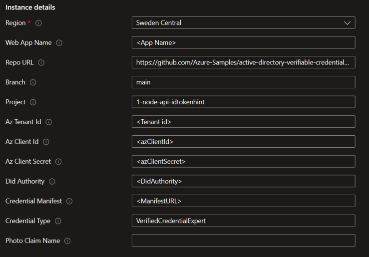

# Verified ID idTokenHint Sample for node.js

This code sample demonstrates how to use Microsoft Entra Verified ID to issue and consume verifiable credentials.

## About this sample

Welcome to Microsoft Entra Verified ID. In this sample, we'll teach you to issue your first verifiable credential: a Verified Credential Expert Card. You'll then use this card to prove to a verifier that you are a Verified Credential Expert, mastered in the art of digital credentialing. The sample uses the preview REST API which supports ID Token hints to pass a payload for the verifiable credential.

## Deploy to Azure

Complete the [setup](#Setup) before deploying to Azure so that you have all the required parameters.


[](https://portal.azure.com/#create/Microsoft.Template/uri/https%3A%2F%2Fraw.githubusercontent.com%2FAzure-Samples%2Factive-directory-verifiable-credentials-node%2Fmain%2F1-node-api-idtokenhint%2FARMTemplate%2Ftemplate.json)

You will be asked to enter some parameters during deployment about your app registration and your Verified ID details. You will find these values in the admin portal. 



The `photo` claim is for presentation to name the claim in the requested credential when asking for a `FaceCheck`. 
For issuance, the sample will use the credential manifest to determind if the credential has a photo or not. 
If you have a claim with a [type](https://learn.microsoft.com/en-us/entra/verified-id/rules-and-display-definitions-model#displayclaims-type) of `image/jpg;base64ur`, then the sample will add the selfie or uploaded photo to that claim during issuance. 

## Additional appsettings that can be used after deployment

These settings can be set in the deployed AppServices Environment Variables configuration. 

| Key | value | Description |
|------|--------|--------|
| issuancePinCodeLength | 0-6 | Length of pin code. A value of 0 means not to use pin code during issuance. Pin code is only supported for [idTokenHint flow](https://learn.microsoft.com/en-us/entra/verified-id/how-to-use-quickstart). If the webapp is used on a mobile device, the sample eliminates the pin code as it makes no sense. |
| useFaceCheck | true/false | If to use FaceCheck during presentation requests. This requires that the credential type asked for has a photo claim. |
| photoClaimName | claim name | The name of the claim in the credential type asked for during presentation when `useFaceCheck` is `true`. The PhotoClaimName is not used during issuance. If the credential manifest has a claim with a type of `image/jpg;base64ur`, that claim will hold the photo. You can override the name of the photo claim by specifying it as a query string parameter, like `/verifier?photoClaimName=photo`. |
| matchConfidenceThreshold | 50-100 | Optional. Confidence threshold for a successful FaceCheck. Default is 70 |

## Test Issuance and Verification

Once you have deployed this sample to Azure AppServices with a working configuration, you can issue yourself a `VerifiedCredentialExpert` credential and then test verification. 
This requires completing the [Verified ID onboarding and creation](https://learn.microsoft.com/en-us/entra/verified-id/verifiable-credentials-configure-issuer) of the `VerifiedCredentialExpert`.
If you want to test presenting and verifying other types and credentials, follow the next section.

## Test Verification via templates

The sample creates a [presentation request](https://learn.microsoft.com/en-us/entra/verified-id/get-started-request-api?tabs=http%2Cconstraints#presentation-request-example) in code based on your configuration in `appsettings.json`. 
You can also use JSON templates to create other presentation requests without changing the configuration to quickly test different scenarios. 
This github repo provises four templates for your convenience. Right-click and copy the below links, remove `http://localhost` from the link and append it to your deployed webapp so you have a URL that looks like `.../verifier.html?template=https://...`. 
You can issue yourself a `VerifiedEmployee` credential at [MyAccount](https://myaccound.microsoft.com) if your organization have onboarded to Verified ID and enabled MyAccount (doc [here](https://learn.microsoft.com/en-us/entra/verified-id/verifiable-credentials-configure-tenant-quick#myaccount-available-now-to-simplify-issuance-of-workplace-credentials)).

| Template | Description | Link |
|------|--------|--------|
| TrueIdentity | A presentation request for a [TrueIdentity](https://trueidentityinc.azurewebsites.net/) credential | [Link](http://localhost/verifier.html?template=https://raw.githubusercontent.com/Azure-Samples/active-directory-verifiable-credentials-dotnet/main/1-asp-net-core-api-idtokenhint/Templates/presentation_request_TrueIdentity.json) |
| VerifiedEmployee | A presentation request for a [VerifiedEmployee](https://learn.microsoft.com/en-us/entra/verified-id/how-to-use-quickstart-verifiedemployee) credential | [Link](http://localhost/verifier.html?template=https://raw.githubusercontent.com/Azure-Samples/active-directory-verifiable-credentials-dotnet/main/1-asp-net-core-api-idtokenhint/Templates/presentation_request_VerifiedEmployee.json) |
| VerifiedEmployee with FaceCheck*| A presentation request for a VerifiedEmployee credential that will perform a liveness check in the Authenticator. This requires that you have a good photo of yourself in the VerifiedEmployee credential | [Link](http://localhost/verifier.html?template=https://raw.githubusercontent.com/Azure-Samples/active-directory-verifiable-credentials-dotnet/main/1-asp-net-core-api-idtokenhint/Templates/presentation_request_VerifiedEmployee-FaceCheck.json) |
| VerifiedEmployee with constraints | A presentation request for a VerifiedEmployee credential that uses a claims constraints that `jobTitle` contains the word `manager` | [Link](http://localhost/verifier.html?template=https://raw.githubusercontent.com/Azure-Samples/active-directory-verifiable-credentials-dotnet/main/1-asp-net-core-api-idtokenhint/Templates/presentation_request_VerifiedEmployee-Constraints.json) |

*Note - FaceCheck is in preview. If you plan to test it, make sure you have the latest Microsoft Authenticator.

You can also use a local file as your template. In this case the template link will be a local file path, like `.../verifier?template=C:\Users\foobar\something\my-presentation-request.json`.

## Contents

The project is divided in 2 parts, one for issuance and one for verifying a verifiable credential. Depending on the scenario you need you can remove 1 part. To verify if your environment is completely working you can use both parts to issue a `VerifiedCredentialExpert` credential and verify that as well.

| Issuance | |
|------|--------|
| public/issuer.html|The basic webpage containing the javascript to call the APIs for issuance. Depending if you use a photo, you will see options to take a selfie or upload a stock photo of you to be issued with the credential. |
| public/selfie.html|HTML page used on mobile device to take the selfie. |
| issuer.js | This is the file which contains the API called from the webpage. It calls the REST API after getting an access token through MSAL. |

| Verification | |
|------|--------|
| public/verifier.html | The website acting as the verifier of the verifiable credential. Depending if you use a photo, you will have a checkbox that let's you create a presentation request with FaceCheck. |
| verifier.js | This is the file which contains the API called from the webpage. It calls the REST API after getting an access token through MSAL and helps verifying the presented verifiable credential.

| Common | |
|------|--------|
| public/index.html|Start page with option to continue with issuance or varification. |
| public\presentation-verified.html | The webpage that displays the result of the presented VC |
| wwwroot/verifiedid.requestservice.client.js|js lib that handles all the API calls to the app |
| wwwroot/verifiedid.uihandler.js |js lib that handles common UI updates |
| CallbackController.cs | Controller that handles common functions between issuance and verification. It handles callback event from Request Service API, the polling requests from the browser and generating the selfie request. |

## Setup

Before you can use Verified ID you need to onboard to it. You can either onboard using the [quick setup](https://learn.microsoft.com/en-us/entra/verified-id/verifiable-credentials-configure-tenant-quick) method or the [manual setup](https://learn.microsoft.com/en-us/entra/verified-id/verifiable-credentials-configure-tenant) method. In the manual method, you use your own Azure Key Vault to store your signing key.

### Create application registration
Follow the documentation for how to do [app registeration](https://learn.microsoft.com/en-us/entra/verified-id/verifiable-credentials-configure-issuer#configure-the-verifiable-credentials-app) for an app with permission to Verified ID.

## Setting up and running the sample
To run the sample, clone the repository, compile & run it. It's callback endpoint must be publically reachable, and for that reason, use a tool like `ngrok` as a reverse proxy to reach your app.

```Powershell
git clone https://github.com/Azure-Samples/active-directory-verifiable-credentials-node.git
cd active-directory-verifiable-credentials-node\1-node-api-idtokenhint
```

### Create your credential
To use the sample we need a configured Verifiable Credential in the azure portal.
In the project directory CredentialFiles you will find the `VerifiedCredentialExpertDisplay.json` file and the `VerifiedCredentialExpertRules.json` file. Use these 2 files to create your own VerifiedCredentialExpert credential.

If you navigate to your [Verifiable Credentials](https://portal.azure.com/#blade/Microsoft_AAD_DecentralizedIdentity/InitialMenuBlade/issuerSettingsBlade) blade in azure portal, follow the instructions how to create your first verifiable credential.

You can find the instructions on how to create a Verifiable Credential in the azure portal [here](https://aka.ms/didfordev)

### Setting app's configuration
The sample uses environment variables for app configuration. The files [setenv.cmd](setenv.cmd) and [setenv.sh](setenv.sh) contains a template for setting the required environment variables before you run the app. You need to update the files with the appropriate values.

```Dos
@echo off
set azTenantId=<tenantId>
set azClientId=<appId>
set azClientSecret=<secret>
set DidAuthority=did:web:...your-domain....com
set clientName=Node.js Verified ID sample
set purpose=To prove you are an Verified ID expert
set CredentialManifest=https://verifiedid.did.msidentity.com/v1.0/tenants/...etc...
set CredentialType=VerifiedCredentialExpert
set acceptedIssuers=%DidAuthority%
set issuancePinCodeLength=4
set sourcePhotoClaimName=
set matchConfidenceThreshold=70
```

| Env var | Source | Description |
|------|--------|--------|
| azTenantId | Directory (tenant) id in AppReg blade | Identifies your Entra ID tenant |
| azClientId | Application (client) id in AppReg blade | Identifies your app |
| azClientSecret | Certificates & secrets in AppReg blade | app's client secret |
| DidAuthority | Verified ID blade | Identifies your Verified ID authority |
| clientName | file | Descriptive name that displays in the Authenticator |
| purpose | file | Descriptive purpose that displays in the Authenticator |
| CredentialManifest | verified ID blade | URL to manifest for credential. Used during issuance. |
| CredentialType | Verified ID blade | type name of credential. Used during presentation to ask for type of VC |
| acceptedIssuers | file | ;-separated list of DIDs of issuers you accept in your presentation request |
| issuancePinCodeLength | file | Value 0-6, where 0 means no pin code |
| sourcePhotoClaimName | file | Name of the photo claim if the presentation request is using FaceCheck  |
| matchConfidenceThreshold | file | Confidence score threshold for FaceCheck. Dault is 70. |

### API Payloads
The sample app doesn't require that you specify JSON payloads in files anymore as it generates the required JSON internally. If you still prefer to use the JSON payloads, you can pass them on the command line and the config values will merge with whatever values are set in environment variables. 

## Running the sample

In order to build & run the sample, you need to have the [node](https://nodejs.org/en/download/) installed locally.

1. After you have edited either of the files [setenv.cmd](setenv.cmd) or [setenv.sh](setenv.sh), depending on your OS, start the node app by running this in the command prompt

```Powershell
npm install
.\setenv.cmd
npm run start
```

1. Using a different command prompt, run ngrok to set up a URL on 8080. You can install ngrok globally from this [link](https://ngrok.com/download).
```Powershell
ngrok http 8080
```

1. Open the HTTPS URL generated by ngrok.

The sample dynamically copies the hostname to be part of the callback URL, this way Verified ID's Request Service can reach your sample web application to execute the callback method.

1. Select Issue Credential

1. In Authenticator, scan the QR code. 
> If this is the first time you are using Verifiable Credentials the Credentials page with the Scan QR button is hidden. You can use the `add account` button. Select `other` and scan the QR code, this will enable the preview of Verifiable Credentials in Authenticator.
1. Select **Add**.

## Verify the verifiable credential by using the sample app
1. Navigate back and click on the Verify Credential button
2. Click Verify Credential button
3. Scan the QR code
4. select the VerifiedCredentialExpert credential and click share
5. You should see the result presented on the screen.


## Troubleshooting

### Did you forget to provide admin consent? This is needed for confidential apps
If you get an error when calling the API `Insufficient privileges to complete the operation.`, this is because the tenant administrator has not granted permissions
to the application. See step 6 of 'Register the client app' above.

You will typically see, on the output window, something like the following:

```Json
Failed to call the Web Api: Forbidden
Content: {
  "error": {
    "code": "Authorization_RequestDenied",
    "message": "Insufficient privileges to complete the operation.",
    "innerError": {
      "request-id": "<a guid>",
      "date": "<date>"
    }
  }
}
```

### Understanding what's going on
As a first source of information, the Node sample will trace output into the console window of all HTTP calls it receives. Then a good tip is to use Edge/Chrome/Firefox dev tools functionality found under F12 and watch the Network tab for traffic going from the browser to the Node app.

## Best practices
When deploying applications which need client credentials and use secrets or certificates the more secure practice is to use certificates. If you are hosting your application on azure make sure you check how to deploy managed identities. This takes away the management and risks of secrets in your application.
You can find more information here:
- [Integrate a daemon app with Key Vault and MSI](https://github.com/Azure-Samples/active-directory-dotnetcore-daemon-v2/tree/master/3-Using-KeyVault)


## More information

For more information, see MSAL.NET's conceptual documentation:

- [Quickstart: Register an application with the Microsoft identity platform](https://docs.microsoft.com/azure/active-directory/develop/quickstart-register-app)
- [Quickstart: Configure a client application to access web APIs](https://docs.microsoft.com/azure/active-directory/develop/quickstart-configure-app-access-web-apis)
- [Acquiring a token for an application with client credential flows](https://aka.ms/msal-net-client-credentials)
